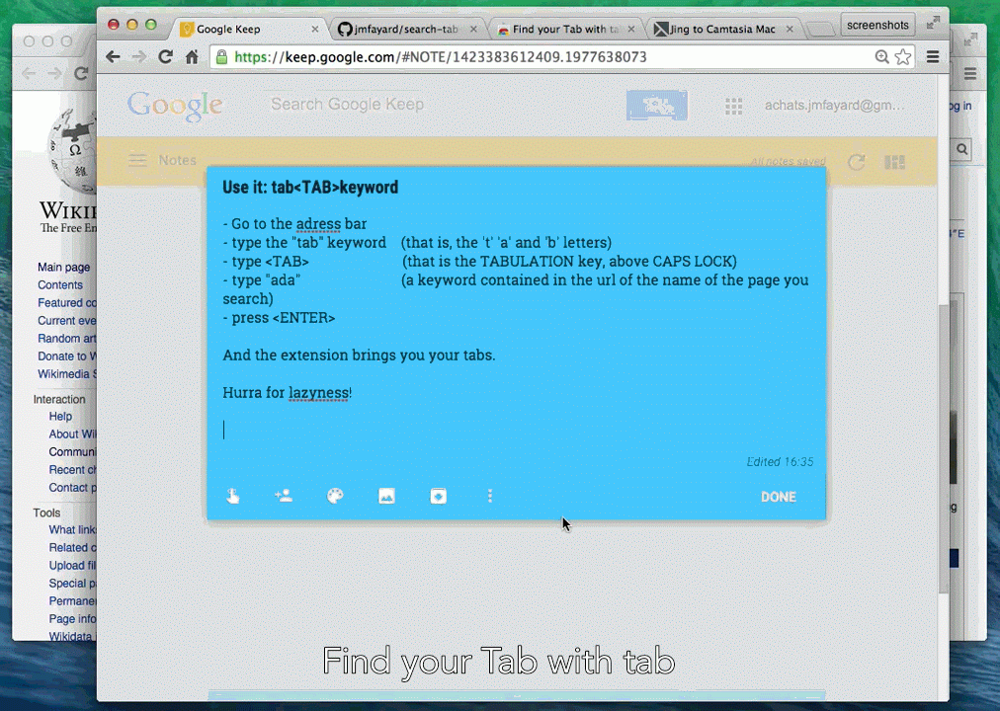

# Tabtabtab for Chrome : Life is too short, tabs too many. Search, don't click!

## TL;DR

- [Screencast on Youtube](https://www.youtube.com/watch?v=2zMJ9-bx46Y)
- Install :  **[tabtabtab in Chrome's Webstore](https://chrome.google.com/webstore/detail/search-tab-in-chromes-omn/jcadgemecbojhfgpnbgakadhbmibflnd)**
- Fork https://github.com/jmfayard/chrome-tabtabtab ... also [pull requests](https://github.com/jmfayard/chrome-tabtabtab/pulls) and [issues](https://github.com/jmfayard/chrome-tabtabtab/issues)
- Contributors: [jmfayard (maintainer)](https://github.com/jmfayard) [aboodman](https://github.com/aboodman) [beaufortfrancois](https://github.com/beaufortfrancois) [j-koenig](https://github.com/j-koenig) [jeffnuss](https://github.com/jeffnuss) [lee-feigenbaum](https://github.com/lee-feigenbaum) [katogarabato](https://github.com/katogarabato)

## Scenario

Tou begin to browse the web with Chrome for a while ; soon you need to go back to *that* tab but there are too many tabs to find quickly exactly the one you need. Sounds familiar ? We know, we have been there.

Don't worry, to solve this *too many tabs* problem, there are a lot of complicated extensions that promise you that you will be able to work with hundreds of tabs : *Too Many Tabs, Tabs Outliner, Bookmark My Tabs, One Tab, TabMan Tabs Manger, Tab Manager, Project Tab Manger, 10+Tabs MASTER →Fast Speed Scroll w/LATER Tab, Resolver Tabs, Tab out, TabJump, TabCaroussel, IE Tab Multi*

 Or you can use this chrome extension, but I'm a bit ashamed to say that it is *really simple* campared to all those sophisticated extensions.

The only thing it does is that when you enter in Chrome's Omnibox **"tab<tab>"** followed by **one or many search term**, it will display a list of all open tabs that contains those search terms.

Upon pressing enter, the extension will select the first match and switch to
that tab, so one need not type press down if the first match is desired.

TODO 
-----------

- add .gif and youtube screencast
- add jump history
- better first time experience
- tab<TAB>help tab<TAB>options tab<TAB>store tab<TAB>github  should suggest to jump the extensions's help/options/webstore/github page

Contribute
------------

- Released under a Free as in Freedom License (see LICENCE)
- Fork and make pull requests to https://github.com/internaciulo/search-tab-in-chrome-s-omnibox
- Never developed a chrome extension yet? Dive in it, it's quite fun. Head over to https://developer.chrome.com/extensions
- You can translate and i18n too. Look in `TRANSLATORS` then `_locales/en/messages.json`

